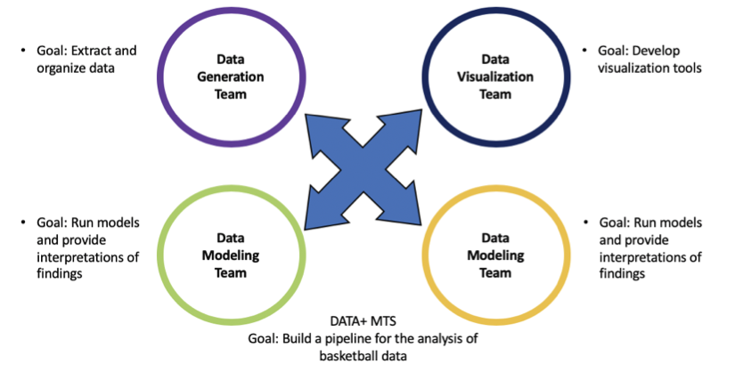

### Research Since 2017

#### Building Better Teams: A Network Analysis Approach

                       

- Ongoing research with Alexander Volfovsky, Raquel Asencio, James Moody, and Katherine Heller.
- The goal is to study the mechanisms of small team and multi-team systems and to develop metrics for evaluating team effectiveness, cohesion, and leadership.
- Observational study and data collection completed; data analysis and manuscript preparation underway.

#### Likelihood-based Inference for Partially Observed Epidemics on Dynamic Networks. 

- Joint work with [Allison Aiello](https://sph.unc.edu/adv_profile/allison-e-aiello-phd/), [Alexander Volfovsky](https://volfovsky.github.io/), and [Jason Xu](https://jasonxu90.github.io/).
- Proposed a stochastic generative model and a data augmentation inference scheme for epidemic processes on dynamic, adaptive contact networks. 
- With applications in analyzing recent, real-world epidemiological data with high resolution social contacts observations.
- Paper accepted by Journal of the American Statistical Association (JASA). ([Online version](https://www.tandfonline.com/doi/full/10.1080/01621459.2020.1790376))
- One of 10 winners of the 2020 SBSS Student Paper Award; also selected as one of the ["research highlights" of JSM 2020](https://www.amstat.org/ASA/News/Newsworthy-Research-Highlights-from-JSM-2020.aspx).

#### SMOGS: Social Network Metrics of Game Success

- Joint work with Sonia Xu, [Katherine Heller](http://www2.stat.duke.edu/~kheller/), and [Alexander Volfovsky](https://volfovsky.github.io/).
- The main goal is to model the latent higher-order network structures in (basketball) player interactions that contribute to overall game outcomes and evaluate both individual- and group-level interaction choices and preferences. The model is applied to high-resolution optical tracking data collected by a top collegiate basketball program.
- [In the proceedings of AiStats 2019.](http://proceedings.mlr.press/v89/bu19a/bu19a.pdf)
  
#### Learning Root Source with Marked Multivariate Hawkes Processes

- Joint work with [Wei Zhang](http://pages.cs.wisc.edu/~zhangwei/), [Derek Owens-Oas](https://stat.duke.edu/people/derek-owens-oas), [Jerry Zhu](http://pages.cs.wisc.edu/~jerryzhu/), and [Katherine Heller](http://www2.stat.duke.edu/~kheller/).
- With applications in group conversations between online users or individuals in real-life settings, eg. [Reddit](https://www.reddit.com/) forum comment data, and transcription of the movie [12 Angry Men](https://en.wikipedia.org/wiki/12_Angry_Men_(1957_film)).
- [arXiv preprint](https://arxiv.org/abs/1809.03648)

### Collaboration/Consulting Work Since 2017

#### Identifying Immune Correlates for HIV Viral Rebound of Infant Rhesus Macaques

- Ongoing experimental data analysis in collaboration with Duke Center for AIDS Research (CFAR), in collaboration with the project PI Dr. Sallie Permar, and quantitative PIs Drs. Cliburn Chan and Janice McCarthy. 
- Using survival analysis and sparse regression methods to identify meaningful immunological predictors for time to HIV viral rebound.

#### Historical Tone Change from Middle Chinese to Modern Beijing Mandarin: Usage-based Phonology and Modeling

- Ongoing work with Haowen Zhang and Maria Giavazzi, Ecole Normale Sup´erieure de Paris.
- Using statistical machine learning methods to identify phonetic features related to the tone change of "_ru_" characters (“入声字”) in Beijing Mandarin, and developing dynamical models for the tone change process based on usage-based phonology theory.

### Undergraduate Research
  
#### Traffic Speed Nowcasting Based on Urban Road Network and Artificial Neural Network
- Graduation project for my B.S. in Peking University. [Chinese version](https://fanbuduke17.github.io/Graduation_Paper.pdf)
- A deep learning project involving Graph CNN, LSTM network, and real-time traffic speed data obtained from taxi GPS tracking records.
  
#### Detection of Differential Genetic Networks
- Undergraduate research project funded by Chinese National Innovative Initiative.
- Won the second prize of the Peking University Research Challenge Cup.
